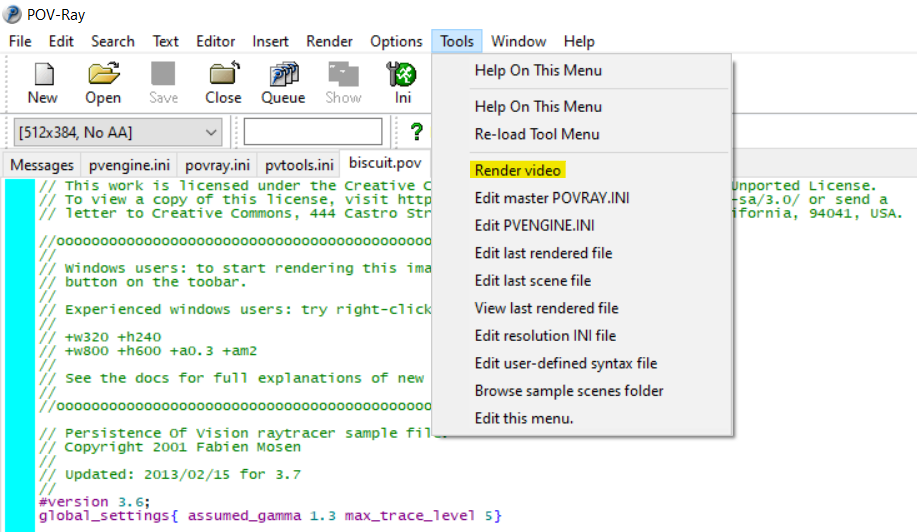

# About
This repository provides an easy way to add a handy entry into the POV-Ray tools menu. The entry called "Render video" determines automatically the location of the last rendered animation and creates a video MP4 file of the animation using Python and moviepy. To get started read the section below

# Installation
### Make sure POV-Ray is not running before proceeding with the installation
- Download the code from Github to your computer
- Unzip the files in a directory of your choice
- Navigate to the install directory
- Run either the install.bat of the install_no_admin.bat. To learn why the installer needs admin privileges and why it might not read: [Why does the installer need admin privileges](README.md#why-does-the-installer-need-admin-privileges)
- Wait for the installer to finish
- Start POV-Ray
- Under the tools menu click "Render video" to render the last animation you made

# Why does the installer need admin privileges?
Usually POV-Ray is installed using an administrator account or the POV-Ray installer is executed as administrator. The POVRender installer determines the location of the POV-Ray documents directory using the according key in the Windows Registry. Said key is located in a folder owned by the administrator account and thereby requiring admin privileges to view. If you choose to use the [non admin installer](install/install_no_admin.bat) you probably will have to specify the location of the POV-Ray documents directory because the installer was not able to find it on its own. If you installed POV-Ray without changing any of the pathes the document directory is "C:\Users\username\Documents\POV-Ray\v3.7". Replace username with the username of the account you are using POV-Ray with.
